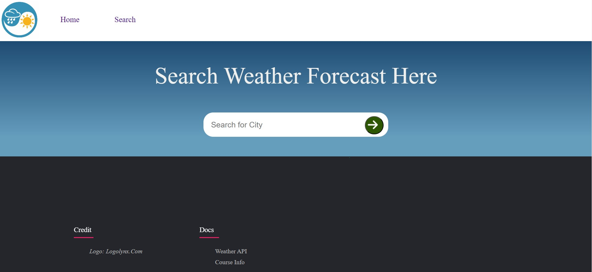

# What's the weather? 

This is a React.JS app that uses the[ OpenWeatherAPI](https://openweathermap.org/api) to fetch the five day forecast of the city searched for, and displays the weather forecast. 

